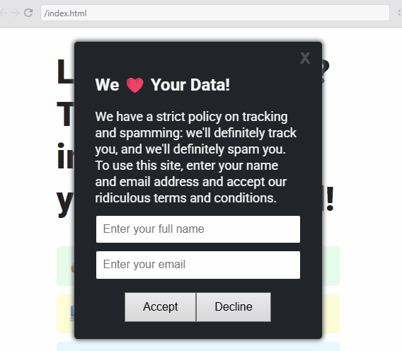
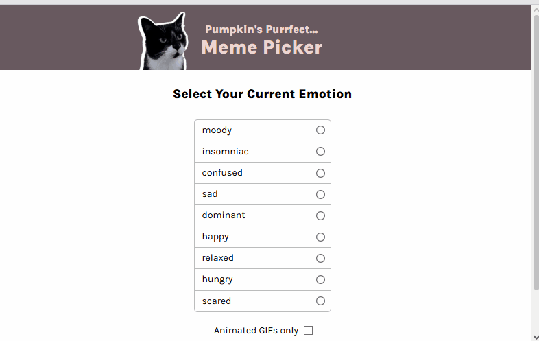

# Scrimba Essential Javascript course Projects 👨‍🎨

This repository is a collection of all the projects I built while completing the Scrimba javascript essentials course.
---

## 🪙 Project 1: World's most annoying cookie consentor!

A website with a cookie consenter that steals your data, and prevents user from closing the form before they submit it.

* **Key Learnings:** setTimeout, element.style, forms, FormData & .get(), flex-directions, event.preventDefault, toggling classes, 'disabled' attribute

### Project demo: 

---
## 😾😼🙀 Project 2: Pumpkin's Perfect Meme Picker

Use Pumpkin's Perfect Meme Picker to generate a gif reflecting your mood !

* **Key Learnings:** for of, import/export modules, radio & checkbox inputs, querySelector, getElementsByClassName, classList.remove, .include(), .filter()

### Project demo: 

---
